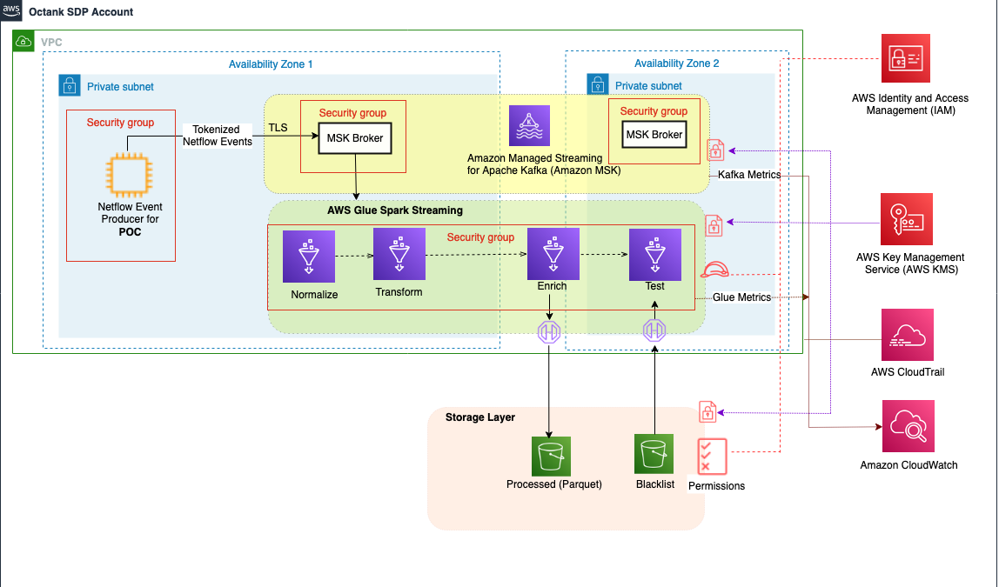

# Infrastructure As Code using AWS CDK POC

Welcome to my workshop this is working code. It will create a `CI/CD` pipeline to deploy bunch of AWS resources in cloud. This is a POC to demonstrate I`nfrastructure As Code (IaC)` to deploy resources in AWS cloud using AWS CDK written in `typescript`.

http://www.rupeshtiwari.com/aws-cdk-poc/

## Architecture Diagram



## Prerequisite

1. AWS account
2. Update `~/.aws/credential` file follow this guideline to [setup your local environment for AWS CDK](https://gist.github.com/rupeshtiwari/1cc9df1218b4d8c86c9232eeacd2b983)



## Getting Started with this repository

```
# clone the repo
git clone https://github.com/rupeshtiwari/aws-cdk-poc

# install node packages
npm ci

# build code
npm run build

# create cloudformation template
cdk synth

# deploy cloudformation template (this will create a code pipeline to deploy bunch of stacks listed below)
cdk deploy

```

## AWS CDK Stacks created in this project

Below are the stacks to create AWS resources like VPC, Cloud9 environment, Roles, S3 buckets, Glue job, AWS MSK cluster.

- **VPC** to create private cloud
- **Cloud9** for development and publishing events to `kafka`
- **Roles** one role for glue job
- **S3Bucket** buckets required for storing scripts and output files
- **Glue** to run Spark stream job
- **AWS MSK** to host broker for messaging framework built on `kafka`

## AWS CodePipeline


Once you deploy your ckd it will create a code pipeline that will build and deploy the entire stack. This will create CI/CD setup so whenever you check-in the code it will build and deploy resources. It takes around 30-40 minutes to deploy entire stack. Especially AWS MSK that takes around 15-20 minutes to deploy.

### 1st Source Stage


- I am using GitHub as my source. As soon as I check-in new code it will trigger the pipeline

### 2nd Build Stage


- Using AWS CodeBuild to build my AWS CDK project it will `npm run build` and `cdk synth` my cdk project. And create cloudformation template put it as encrypted assets in the S3 bucket.

### 3rd Deployment Stage for Dev environment


Above are the stacks going to be deployed in DEV environment.

### 4th Deployment Stage for Prod environment


Similar stacks will be deployed in prod environment after manual approval.

## CDK Project details

This is a blank project for TypeScript development with CDK.

The `cdk.json` file tells the CDK Toolkit how to execute your app.

### Useful commands

- `npm run build` compile typescript to js
- `npm run watch` watch for changes and compile
- `npm run test` perform the jest unit tests
- `cdk deploy` deploy this stack to your default AWS account/region
- `cdk deploy --all` deploy all stacks to your default AWS account/region
- `cdk diff` compare deployed stack with current state
- `cdk synth` emits the synthesized CloudFormation template
- `cdk destroy` delete stack

Ø

- `git pull && git add . && git commit -m 'updates' && git push`

- https://medium.com/@kargawal.abhishek/aws-cdk-deploy-managed-etl-using-aws-glue-job-1925098ec40f

- https://datachef.co/blog/deploy-pythonshell-gluejob-using-cdk/
- [Glue CDK Args](https://docs.aws.amazon.com/glue/latest/dg/aws-glue-programming-etl-glue-arguments.html)
- [CI/CD AWS CDK Demo](https://github.com/rupeshtiwari/ci-cd-aws-pipeline-demo-cdk)

<script async src="https://pagead2.googlesyndication.com/pagead/js/adsbygoogle.js?client=ca-pub-1700383344966810" crossorigin="anonymous"></script>
<!-- Homepage Leaderboard -->

<ins class="adsbygoogle"
style="display:inline-block;width:728px;height:90px"
data-ad-client="ca-pub-1700383344966810"
data-ad-slot="1234567890"></ins>

<script>
(adsbygoogle = window.adsbygoogle || []).push({});
</script>
